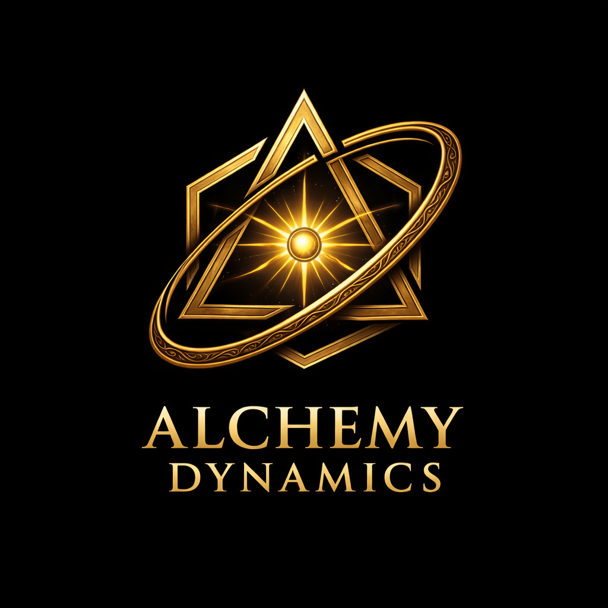

# Alchemy Dynamics — Screensaver

A purple star-travel screensaver for **Alchemy Dynamics**. The logo floats at the
center of an endless violet starfield while you cruise slowly past the stars.
Optional **webcam head tracking** lets you steer: turn your head and the field
leans the way you look — subtle, but noticeable.



## Features

- **Traveling starfield** — true 3D perspective so near stars sweep past faster
  than far ones (real parallax, not faked layers).
- **Purple palette** — violet / indigo / magenta cores with soft glows and gentle
  motion streaks.
- **Centered logo** — slow float + a slight 3D lean that follows your gaze.
- **Head steering** — MediaPipe FaceLandmarker reads your head yaw/pitch and
  nudges the vanishing point in that direction.
- **Graceful fallback** — no camera (or permission denied)? Steer with the mouse.
  Idle? It drifts on its own.

## Run it

It's a static page — no build step.

```bash
# from the project folder
python3 -m http.server 8000
# then open http://localhost:8000
```

> A local server (or HTTPS) is required for the webcam: browsers only grant
> camera access on `http://localhost` or `https://`. Opening `index.html`
> directly via `file://` works for the starfield + mouse, but not head tracking.

### Controls

| Input | What it does |
|-------|--------------|
| **Enter with head tracking** | Asks for the camera, then steers by head turn |
| **Continue without camera** | Mouse-only steering |
| Move mouse | Steer the field (overrides nothing if tracking is on) |
| Idle | Falls back to a slow autonomous drift |

### Choosing which camera

If you have more than one camera (e.g. a laptop cam **and** an external webcam),
pick the one you want from the **Camera** dropdown on the start screen. Once
tracking is running you can also switch on the fly: move the mouse to wake the
small status pill (bottom center) and choose a different camera from its
dropdown. Your choice is remembered for next time.

> Camera *names* only appear after you've granted permission once. On the very
> first run the dropdown may be empty — click **Enter with head tracking**, allow
> access, and the names will populate (and persist on later launches).

## Multi-monitor video wall

The starfield is a single full-window canvas, so to run it as **one continuous
scene across three (or more) monitors** you just need one browser window that
spans the whole extended desktop — the logo lands on the center screen and the
stars flow across all of them. Head tracking still works because it's one page
sharing the one webcam.

On Windows, double-click **`launch-wall.bat`** (or right-click
`launch-wall.ps1` → *Run with PowerShell*). It auto-detects the full
virtual-desktop size and opens a chromeless Chrome/Edge window sized to span
every monitor. Click **Enter with head tracking** once and allow the camera.

Requirements / tips:
- Monitors should be **arranged in one row** in *Display Settings* (same height
  rows span cleanly; an L-shaped layout leaves gaps).
- The launcher points at the live GitHub Pages build over HTTPS so the webcam is
  allowed. To use a local copy, edit `$Url` in `launch-wall.ps1` and serve the
  folder first.
- Exit with **Alt+F4**.

Doing it by hand instead: open the page, un-maximize the window, drag it to the
top-left monitor, and resize until it covers all three.

## How the steering works

Each star has a 3D position; the camera flies forward and stars are recycled to
the far plane as they pass. Your look direction (head or mouse) shifts the
vanishing point and adds a small lateral velocity that scales with each star's
proximity — so steering reads as genuine parallax depth, kept deliberately gentle.

## Tech

Plain HTML + Canvas 2D, zero dependencies bundled. Head tracking loads
[`@mediapipe/tasks-vision`](https://developers.google.com/mediapipe) from a CDN
at runtime, so the page stays tiny and works offline for everything except the
optional tracker.

---

© Alchemy Dynamics
